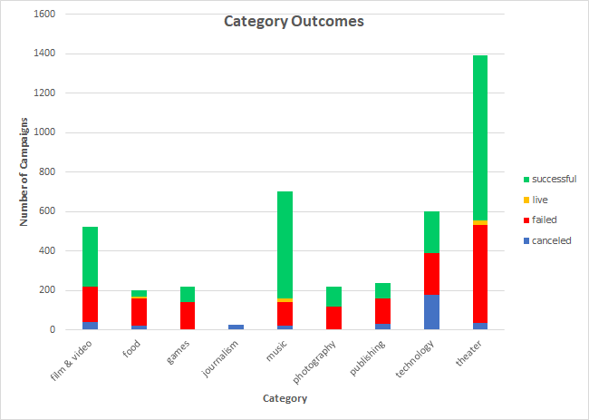

# An Analysis of Kickstarter Campaigns
This analysis of Kickstarter camplaign data aims to determine factors which affect a campaign's success for the purpose of making recommendations for launching a theater campaign. While the data available included campaigns from many countries and categories, the majority of the data comes from the US, and the main focus of this analysis is Theater campaigns. From this analysis, it was determined that:
- There are more theater campaigns than any other campaigns (as shown Category Outcomes chart below)
- The most successful theater campaigns were launched in May or June (as shown in Outcomes Based on Launch Date chart below)

