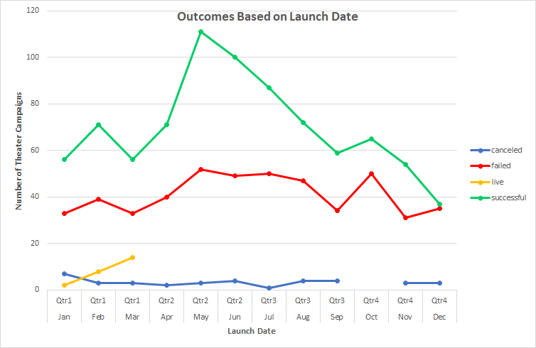

# An Analysis of Kickstarter Campaigns
This analysis of Kickstarter camplaign data aims to determine factors which affect a theater campaign's rate of success.

While the data available included campaigns from many countries and categories, the majority of the data comes from the **US**, and the main category is **theater**.
- There are more theater campaigns than any other campaigns, as shown in the **Category Outcomes** chart below:
  

- There are more successful theater campaigns which funded plays than any other subcategory as shown in the **Subcategory Outcomes** chart below
  

## Statistical analysis of Theater Campaigns (Plays)

To further research theater campaigns, statistical analysis was conducted on theater campaigns launched in both the US and in GB.

From the analysis that follows, it seems that the US data is much more representative of a normal sample by comparison with the GB data, which has a very small sample size (only 27 campaigns).

### US Theater Campaigns

The following table presents descriptive statistics for the Kickstarter theater (plays) campaigns launched in the US.

|     | Successful | Failed |
------|------------|--------|
|Mean Goal| $5,049 | $10,554 |
|Median Goal| $3,000| $5,000 |
|Standard Deviation of Goal | $7,749 | $21,968 |
|Upper Quartile of Goal | $5,000 | $10,000 |
|Lower Quartile of Goal | $1,500 | $2,000 |
|IQR of Goal| $3,500 | $8,000 |
|      |           |        |
|Mean Pledged | $5,602 | $559 |
|Median Pledged |$3,168 | $103 |
|Standard Deviation of Pledged | $8,335 | $1,331 |
|Upper Quartile of Pledged | $5,699 | $501 | 
|Lower Quartile of Pledged | $1,717 | $9 |
|IQR of Pledged | $3,982 | $492 |

From here, we can see that the mean goal and mean pledged is close to the upper quartile for both successful and failed campaigns. Respective standard deviations are larger than their respective means; all data points below the mean are close to center. Further, the standard deviations for the successful campaigns are about double the IQR; whereas they are about triple in the failed campaigns. There are likely outliers with very high goals in the failed Kickstarter campaigns.

At a glance, it seems that the successful campaigns had lower fundraising goals; however, if we were to remove outliers from the failed campaigns, we the seemingly significant difference in goal will certainly be less pronounced, if significant at all.

### British Theater Campaigns

The following box plot shows an analysis of Kickstarter theater campaigns (musicals) in GB.

A quick glance shows that in this very small sample, in which there are 2 outliers, the mean goal is much higher than the mean pledge. This indicates that the campaigns which failed did not come close to meeting the fundraising goals.

Though the mean goal was £4,000, it is skewed by the outlier for goal. This is considerably outside the range of outliers for amount pledged, so the mean goal would not serve as a good data point upon which to base recommendations.

Based on the median, it is clear that half the campaigns had goals of £2,000 or less. Thi salso happens to be a bit over the 3rd quartile for amounts pledged.

#### High-Level Recommendations for Kickstarter Theater Campaigns
Based on the data available, the recommendations are as follows:
- Campaign category is an indicator in its own right with respect to the liklihood of meeting its fundraising goal. Categories like *Theater* and *Music* have a better chance of receiving funding than categories like *food*, *photography*, *journalism* or *publishing*, for example.
- Campaign goals should be realistic. Setting unrealistic goals is a recipe for failure.

## Challenge
The analysis conducted up to this point has had a broader focus. For this challenge, data will be used to make specific recommendations for running successful Kickstarter campaign to fund a **play** in the US.

The two questions that have informed this analysis are:
1. What should the fundraising goal be?
2. When should the campaign be launched?

### Analysis for Kickstarter plays based on goal
The following table summarizes the number and percentage of plays that were successful, failed, and were canceled based on goal amount.

| Goal | Number Successful | Number Failed | Number Canceled | Total Projects | Percentage Successful | Percentage Failed | Percentage Canceled |
|------|-------------------|---------------|-----------------|----------------|-----------------------|-------------------|---------------------|
|Less than $1,000|141|45|0|186|75.81%|24.19%|0.00%
|$1,000 to $4,999|388|146|0|534|72.66%|27.34%|0.00%
|$5,000 to $9,999|93|76|0|169|55.03%|44.97%|0.00%
|$10,000 to $14,999|39|33|0|72|54.17%|45.83%|0.00%
|$15,000 to $19,999|12|12|0|24|50.00%|50.00%|0.00%
|$20,000 to $24,999|9|11|0|20|45.00%|55.00%|0.00%
|$25,000 to $29,999|1|4|0|5|20.00%|80.00%|0.00%
|$30,000 to $34,999|3|8|0|11|27.27%|72.73%|0.00%
|$35,000 to $39,999|4|2|0|6|66.67%|33.33%|0.00%
|$40,000 to $44,999|2|1|0|3|66.67%|33.33%|0.00%
|$45,000 to $49,999|0|1|0|1|0.00%|100.00%|0.00%
|Greater than $50,000|2|14|0|16|12.50%|87.50%|0.00%

Here is a visual representation of the same information:

### Analysis for Kickstarter plays based on timing
In an attempt to make recommendations for when to launch a campaign, 2 factors seemed relevant:
1. Campaign Launch Date
2. Campaign Duration

These two factors are both important since length of campaign cannot be determined by launch date, and the duration of the campaign may also be a key factor in whether or not a campaign will be funded.

##### Campaign Launch Date
The following chart shows outcomes of theater campaigns based on launch date.

##### Campaign Duration
The following chart shows outcomes of theater campaigns based on campaign duration.

This particular visualization hints that the dataset may have many points in the 30-day range, and not many elsewhere.

While this measure, on the surface seemed to be a good idea, the outcome does not seem to be affected by campaign duration on its own.

#### Observations and Limitations
If we were to only consider the visual representation for goal, then it would seem that goal is not a good indicator of chances for success.

However, considering that the overall spread for goal amount is broad in this dataset, approximately 85% of the data resides within the first 3 goal ranges (i.e. Less than $1,000 to $9,999). Based on this, it would seem inappropriate to draw conclusions based on the entire dataset.

Taking into consideration only those campaigns which had goals up to $9,999, it seems the likelihood of a campaign to fund a play successfully decreases as goal amount increases. This is observed more profoundly when moving from a goal of **$1,000 to $4,999** to a goal of **$5,000 to $9,999** by comparison with moving from a goal of Less than $1,000 to a goal of **$1,000 to $4,999**.

As noted above, the answer to the question about how long a campaign should run is not answered adequately by looking only at launch date. Campaign duration without taking into account launch date does not render a visualization upon which to draw meaningful conclusions.

##### Recommendations
Based on the observations and limitations described above, the recommended amount for the campaign goal to fund a play would be $4,999 or less.

To strive to make a better recommendation, perhaps it might be more useful to include all theater campaigns (as opposed to just plays) in this type of analysis so that more meaningful conclusions could be drawn on a larger dataset.

Additionally, a box plot of this data would be very useful in quickly showing the spread of this data visually.

With regard to the timing for the campaign, data indicates that the best time to launch for increased chances of a successful a campaign would be in May / June.

It is recommended that further analysis should take place to determine how long a campaign should run. Specifically, it would be interesting to look at duration and start date together. For example, running this analysis by looking at outcomes based on duration while filtering on start date (month).

### Conclusions
Based on the analysis provided here (and all of its limitations), the best recommendation would be to launch a 30-day campaign beginning in May, with a goal up to $4,999.

This data certainly is not without its limitations, which have been noted throughout. Further analysis is recommended on data that more realistically represents the whole.